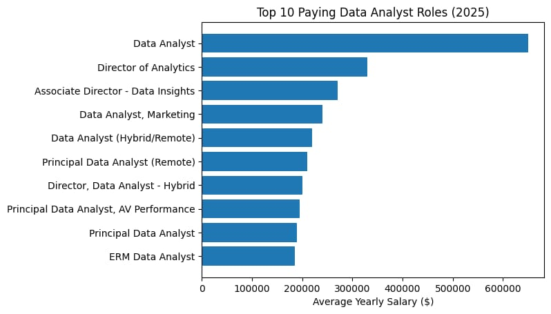

# INTRODUCTION
This project analyzes the 📊 data analytics job market using SQL to uncover 💰 top-paying jobs, 🚀 in-demand skills, and 🧠 high-value skill sets. It demonstrates strong skills in 🔍 data exploration, joins, and aggregations to solve real-world business problems.

SQL quesries check them out here: [project_sql folder](/project_sql/)

# BACKGROUND
With the rapid growth of 📈 data analytics, understanding 💼 job trends and 🛠 required skills has become essential for aspiring analysts. This project was created to explore real-world job data and identify 🎯 what skills and roles offer the best opportunities in today’s market.

Data hails from [this course ](https://lukebarousse.com/sql)
# TOOLS I USED
- PostgreSQL – Used to manage the database and perform complex SQL queries for data analysis

- VS Code – Served as the primary code editor for writing, organizing, and testing SQL scripts

- Git – Used for version control to track changes and maintain project history

- GitHub – Hosted the project repository, enabling easy sharing and showcasing of the work
# THE ANALYSIS
Each query for this project aimed at investigating specific aspects of the data analyst job market. Here's how I approached each question:
### 1. Top Paying Data Analyst Jobs
To identify the highest-paying roles, I filtered data analyst positions by average yearly salary and location, focusing on remote jobs. This query highlights the high paying opportunities in the field.
```sql
SELECT 
    job_id,
    job_title,
    job_location,
    job_schedule_type,
    salary_year_avg,
    job_posted_date,
    name as company
FROM 
    job_postings_fact
LEFT JOIN company_dim on job_postings_fact.company_id = company_dim.company_id
where
 job_title_short='Data Analyst' AND job_location='Anywhere'
AND salary_year_avg IS NOT NULL
ORDER BY
 salary_year_avg DESC                            LIMIT 10
```
Here's the breakdown of the top data analyst jobs

*Wide Salary Range:* Top 10 paying data

analyst roles span from $184,000 to $650,000, indicating significant salary potential in the field.

*Diverse Employers:* Companies like

SmartAsset, Meta, and AT&T are among those offering high salaries, showing a broad interest across different industries.

*Job Title Variety:* There's a high diversity

in job titles, from Data Analyst to Director of Analytics, reflecting varied roles and specializations within data analytics.

*Bar graph visualizing the salary for the top 10 roles for data analysts; chatgpt genrated this graph from my sql quesry results*
### 2. Skills for Top Paying Jobs
To understand what skills are required for the top-paying jobs, I joined the job postings with the skills data, providing insights into what employers value for high-compensation roles
``` sql
with top_paying_job as(
SELECT 
    job_id,
    job_title,
    job_schedule_type,
    salary_year_avg,
    name as company
FROM 
    job_postings_fact
LEFT JOIN company_dim on job_postings_fact.company_id = company_dim.company_id
where
 job_title_short='Data Analyst' AND job_location='Anywhere'
AND salary_year_avg IS NOT NULL
ORDER BY
 salary_year_avg DESC                             LIMIT 10
)
select 
top_paying_job.*,
skills
from top_paying_job
```
Here's the breakdown of the most demanded skills for the top 10 highest paying data analyst jobs:

- SQL is leading with a bold count of 8.

- Python follows closely with a bold count of 7.

- Tableau is also highly sought after, with a bold count of 6. Other skills like R, Snowflake, Pandas, and Excel show varying degrees of demand
.png)
*Bar graph visualizing the most demanded skills for the top 10 highest paying data analyst jobs; chatgpt genrated this graph from my sql quesry results*
### 3.In-Demand Skills for Data Analysts
This query helped identify the skills most frequently requested in job postings, directing focus to areas with high demand
```sql
SELECT 
    skills,
    count(skills_job_dim.job_id) as demand
FROM job_postings_fact
INNER JOIN skills_job_dim ON job_postings_fact.job_id = skills_job_dim.job_id
INNER JOIN skills_dim on skills_job_dim.skill_id = skills_dim.skill_id
where job_title_short='Data Analyst'
GROUP BY skills
ORDER BY demand DESC
limit 5
```
Here's the breakdown of the most demanded skills for data analysts:

- SQL and Excel remain fundamental, emphasizing the need for strong foundational skills in data processing and spreadsheet manipulation.

- Programming and Visualization Tools like Python, Tableau, and Power BI are essential, pointing towards the increasing importance of technical skills in data storytelling and decision support.
### 📈 Top 5 In-Demand Skills

| Skill    | Demand Count |
|----------|-------------|
| SQL      | 7291        |
| Excel    | 4611        |
| Python   | 4330        |
| Tableau  | 3745        |
| Power BI | 2609        |
### 4.Skill Based on Salary
Exploring the average salaries with different skills revealed which skills are the highest paying 
```sql
SELECT 
    skills,
   round( AVG(salary_year_avg),2) as avg_salary
FROM job_postings_fact
INNER JOIN skills_job_dim ON job_postings_fact.job_id = skills_job_dim.job_id
INNER JOIN skills_dim on skills_job_dim.skill_id = skills_dim.skill_id
where job_title_short='Data Analyst' AND salary_year_avg > 0
GROUP BY skills
ORDER BY avg_salary DESC
limit 25
```
Here's a breakdown of the results for top paying skills for Data Analysts:

- **High Demand for Big Data & ML Skills:** Top salaries are commanded by analysts skilled in big data technologies (PySpark, Couchbase), machine learning tools (DataRobot, Jupyter), and Python libraries (Pandas, NumPy), reflecting the industry's high valuation of data processing and predictive modeling capabilities.

- **Software Development & Deployment Proficiency:** Knowledge in development and deployment tools (GitLab, Kubernetes, Airflow) indicates a lucrative crossover between data analysis and engineering, with a premium on skills that facilitate automation and efficient data pipeline management.

- **Cloud Computing Expertise:** Familiarity with cloud and data engineering tools (Elasticsearch, Databricks, GCP) underscores the growing importance of cloud-based analytics environments, suggesting that cloud proficiency significantly boosts earning potential in data analytics.
### 💰 Top 10 Highest Paying Skills for Data Analysts

This analysis highlights the average salary associated with key technical skills, helping identify high-value tools in the data analytics domain.

| Skill        | Average Salary ($) |
|--------------|-------------------:|
| pyspark      | 208,172            |
| bitbucket    | 189,155            |
| couchbase    | 160,515            |
| watson       | 160,515            |
| datarobot    | 155,486            |
| gitlab       | 154,500            |
| swift        | 153,750            |
| jupyter      | 152,777            |
| pandas       | 151,821            |
| elasticsearch| 145,000            |

*Table: Average salary distribution for top-paying data analyst skills.*

# WHAT I LEARNED 

Throughout this project, I enhanced my SQL proficiency and developed strong analytical thinking by working on real-world data analysis problems.

- 🧩 *Complex Query Crafting:* Mastered advanced SQL techniques such as joins, subqueries, and Common Table Expressions (CTEs) to manipulate and analyze data efficiently.

- 📊 *Data Aggregation:* Utilized aggregate functions like COUNT() and AVG() with GROUP BY to summarize datasets and uncover trends.

- 💡 *Analytical Thinking:* Strengthened problem-solving skills by converting business questions into actionable SQL queries for meaningful insights.
# CONCLUSION

This project highlights key trends in the data analyst job market, emphasizing the importance of combining foundational skills (SQL, Excel) with advanced tools (Python, Tableau, big data technologies).

Focusing on high-demand and high-paying skills provides a strategic path for building a successful career in data analytics.
